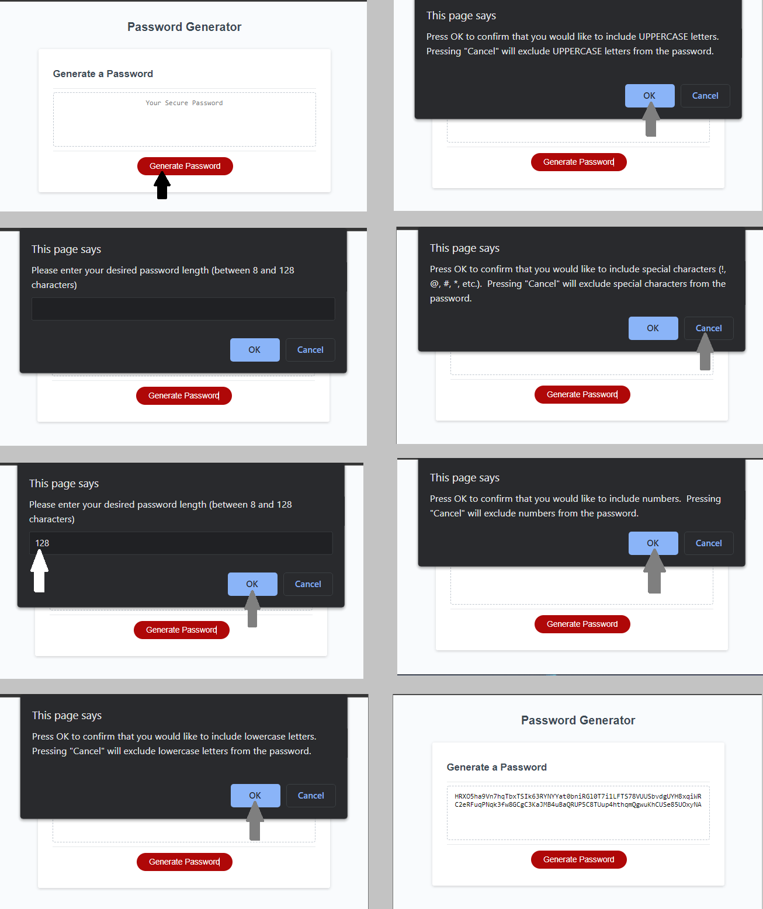

# Random Password Generator

## Purpose and Functionality
This site uses JavaScript to generate a random password for the user.  The application prompts the user through a series of questions to retrieve password complexity data.  
* The user is prompted for a password length.
* The user is prompted for which characters to include in the password.
    * UPPERCASE
    * lowercase
    * symbols (!, ^, &, #, *, %, @, $)
    * numbers
* The application verifies that appropriate inputs were provided by the user (password length is a number between 8 and 128 (inclusive), and at least one character set was selected by the user).
* The application iterates against a set of loops to build a string that meets the password complexity requirements set by the user.
* The application verifies that the password contains at least one of each requested character.  If it does not contain one of the requested characters, it loops back to generate a new password until one passes the validation test.
* The application displays the generated password in a box that the user can then copy / paste out of.
    * If the button is pressed after a password has been generated and displayed, the application will reset the variables and generate a new password based on the new set of prompt responses from the user. 

## Key Learnings
* strengthening JS skills including:
    * how to use prompts, confirms, and alerts
    * more familiarity with general JavaScript syntax
    * function defining, writing, and calling
    * data input validation using logical operators
    * use of for loops, while loops, and if / else if / else statements
        * nesting loops to iterate across two different variables
        * iterating across arrays and strings
    * testing and optimizing code

## Deployed Site
The deployed site is hosted on github pages at the following link: 

https://aavillanueva6.github.io/passwordGenerator/

## Screenshots
* The first image is a section of the script.js file.  It shows some of the key functionality of the code including:
    * uer confirms for character selection, including validation that at least one character type was selected
    * logic to build the acceptable character array based on user confirms
    * beginning of loop used to randomly build password string
    * logic and loop to validate that at least one of each requested character type is included in the password
* The second image is a series of screenshots of the application as the user steps through the prompts, ending in a password that is 128 characters in length, containing lower case letters, upper case letters, and numbers.  User did not confirm symbols during this series of screenshots.

## Known Bugs
* none

## Potential future improvements
* Possibly change inputs from prompts and confirms a more user friendly method (i.e. check boxes with a submit button that generates without any further prompts)
* Create additional buckets that remove characters to make the password easier to read (not including O's and zero's, etc.)
    * add this as a selection criteria during the user interaction portion of the application

